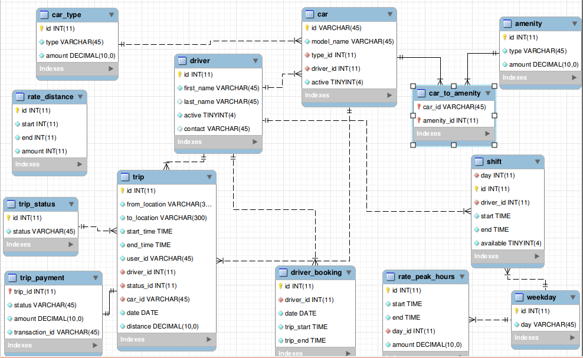

### Server

1. Add database configurations in file `server/config/mysql.json`.
2. set environment variable `REACT_APP_GOOGLE_KEY` with google map api key 
2. Run following commands in terminal to start server
    ```
     > cd server
     > export REACT_APP_GOOGLE_KEY=<YOUR GOOGLE MAP API KEY>
     > npm i
     > npm start
    ```
3. To generate schema and tables with sample data in mysql execute following commands. it creates new schema named `app`.
    ```
     > mysql -u <username> -p<password> < dump.sql
    ```
4. server runs on default port number 3001

### Website

1. start server first.
2. Run following commands in terminal to start serving web app
    ```
     > cd web
     > export REACT_APP_GOOGLE_KEY=<YOUR GOOGLE MAP API KEY>
     > npm i
     > npm start
    ```
3. visit [ http://localhost:3000 ](http://localhost:3000/)


## EER 

